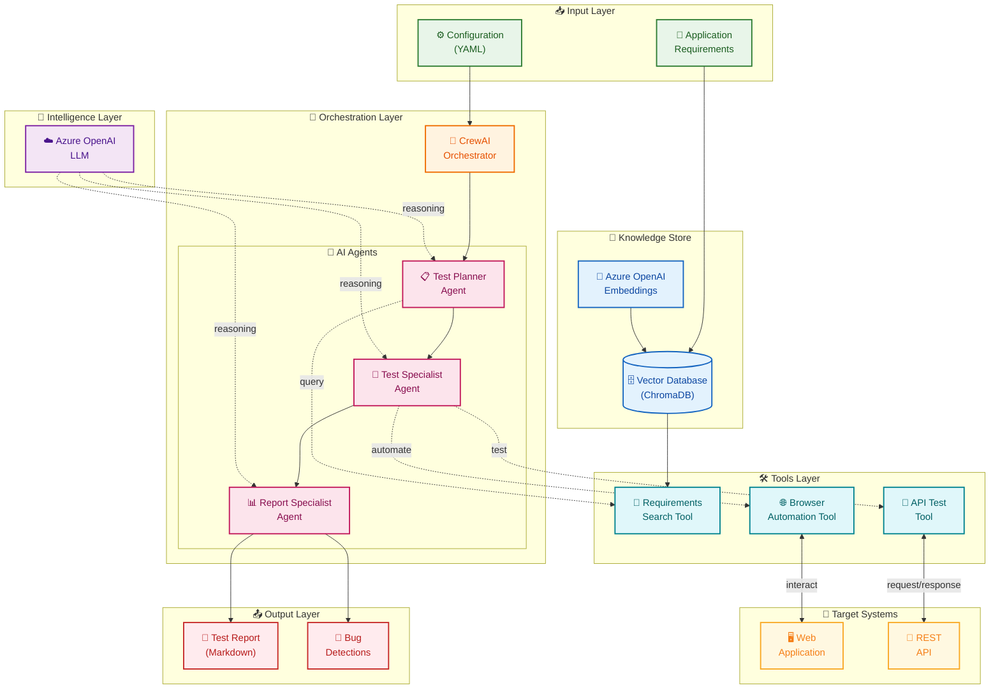

# Autonomous Tester - Architecture

## Overview

The **Autonomous Tester** is an AI-powered testing framework built on [CrewAI](https://www.crewai.com/) that automates software testing through intelligent agents. It leverages Large Language Models (LLMs) to understand application requirements, generate test strategies, execute tests, and produce comprehensive reports.

### Key Capabilities

- **Automated Test Planning** — Analyzes requirements documents to create testing strategies
- **Multi-Protocol Testing** — Supports both Web UI (browser automation) and REST API testing
- **Intelligent Validation** — Validates responses against expected outcomes using AI reasoning
- **Automated Reporting** — Generates detailed markdown reports with bug detections

---

## High-Level Architecture



---

## Component Details

### 📥 Input Layer

| Component | Description |
|-----------|-------------|
| **Application Requirements** | Text files describing the application's expected behavior and features |
| **Configuration (YAML)** | Agent definitions, task configurations, and task collections |

### 💾 Knowledge Store

| Component | Description |
|-----------|-------------|
| **Vector Database** | ChromaDB instance storing embedded requirements for semantic search |
| **Embeddings** | Azure OpenAI embedding model for converting text to vectors |

### 🎯 Orchestration Layer

| Component | Description |
|-----------|-------------|
| **CrewAI Orchestrator** | Manages sequential execution of agents and task dependencies |
| **Test Planner Agent** | Analyzes requirements and creates comprehensive test strategies |
| **Test Specialist Agent** | Executes test cases using browser and API tools |
| **Report Specialist Agent** | Synthesizes results into actionable bug reports |

### 🛠️ Tools Layer

| Tool | Purpose |
|------|---------|
| **Requirements Search Tool** | RAG-based semantic search over requirements documents |
| **Browser Automation Tool** | Headless browser control via `browser_use` library |
| **API Test Tool** | HTTP client with validation (status codes, JSON paths, headers) |

### 📤 Output Layer

| Output | Format |
|--------|--------|
| **Test Report** | Markdown file with detailed test results |
| **Bug Detections** | Structured findings with reproduction steps |

---

## Data Flow

```
1. Requirements (TXT) → Embedded → Vector DB
2. User triggers test with --type and --endpoint
3. CrewAI loads task description from task_collections.yaml
4. Sequential agent execution:
   ├─ Test Planner → reads requirements → outputs test plan
   ├─ Test Specialist → executes tests → outputs results  
   └─ Report Specialist → analyzes results → outputs report
5. Final report written to test_report.md
```

---

## Technology Stack

| Layer | Technology |
|-------|------------|
| **Framework** | CrewAI |
| **LLM Provider** | Azure OpenAI |
| **Vector Store** | ChromaDB |
| **Browser Automation** | browser_use |
| **HTTP Client** | requests |
| **Configuration** | YAML, python-dotenv |
