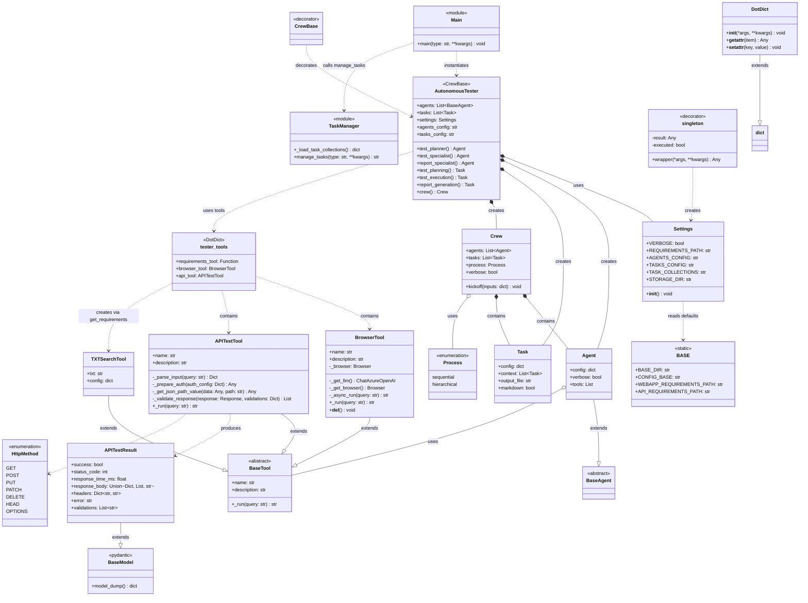

# Autonomous Tester - Class Diagram



## Class Descriptions

### Core Components

| Class | Description |
|-------|-------------|
| `AutonomousTester` | Main crew orchestrator decorated with `@CrewBase`. Creates and manages agents, tasks, and the crew workflow. |
| `Settings` | Configuration class that loads environment variables and provides paths for config files. |
| `BASE` | Static configuration holding base directory paths and default requirements file locations. |

### Agents & Tasks

| Component | Role |
|-----------|------|
| `test_planner` | Agent responsible for planning the testing strategy using requirements tool. |
| `test_specialist` | Agent that executes tests using browser and API tools. |
| `report_specialist` | Agent that generates test reports from execution results. |
| `test_planning` | Task for creating the test strategy. |
| `test_execution` | Task for running tests (depends on test_planning). |
| `report_generation` | Task for generating markdown reports (depends on test_execution). |

### Tools

| Tool | Purpose |
|------|---------|
| `BrowserTool` | Performs browser automation tasks using `browser_use` library. Supports async operations. |
| `APITestTool` | Tests REST APIs with validation capabilities (status codes, headers, JSON paths, response time). |
| `TXTSearchTool` | Searches requirements documents using embeddings (from crewai_tools). |

### Utilities

| Utility | Purpose |
|---------|---------|
| `DotDict` | Dictionary subclass enabling dot-notation access (`d.key` instead of `d['key']`). |
| `APITestResult` | Pydantic model for structured API test results. |
| `HttpMethod` | Enum defining supported HTTP methods. |
| `singleton` | Decorator ensuring single instance creation for functions like `get_settings()`. |

### Data Flow

```
main() 
  → manage_tasks() → loads task_collections.yaml
  → AutonomousTester().crew() 
    → creates agents with tools
    → creates tasks with dependencies
    → Crew.kickoff(inputs) → sequential execution
```
